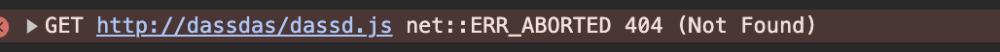
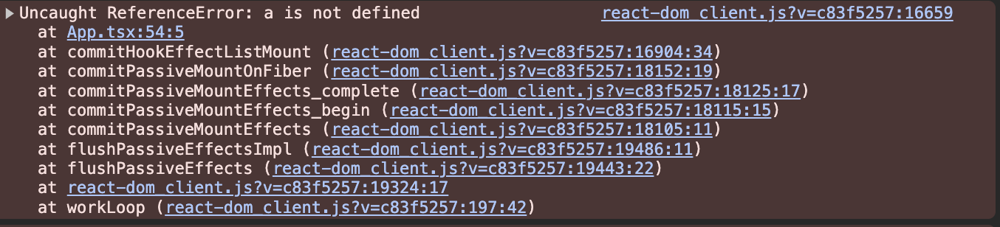

# 什么是前端错误监控

为什么我们需要前端错误监控？

试想一下，如果你的页面没有前端错误监控，会出现什么问题？

- 假设你的页面的一个script的加载过程发生错误，那么很有可能导致渲染出错，页面白屏。

- 假设你的点击事件写了形如 `a.b.c` 这样的代码，但是其中有属性为空，就会导致用户操作意外终止。

如果没有 JS 错误监控，开发者完全感知不到线上这些异常情况。即使你的业务有客诉等反馈渠道，但问题发现的时候常常为时已晚，影响面非常大。

所以，来下个定义： 前端错误监控是一种重要的开发实践，它涵盖了对前端页面中发生的错误的持续跟踪和监控。这个过程不仅包括对错误的自动检测，而且还包括对这些错误的记录和报告。这种监控的主要目的是在出现异常错误时，能够及时地向开发者发送告警提醒。这样，开发者就能在最早的时间内了解到错误的存在，从而可以立即开始解决问题。

# 前端错误监控的目标

前端错误监控的目标是提供一个持续、自动、全面的方式来保证前端应用的质量和性能，从而提升用户体验和业务效果。它可以分为以下四个目标：

## 错误发现

通过自动收集和报告错误，我们可以快速发现在开发过程中或者上线后出现的问题，而不是等待用户反馈。

## 错误定位

详细的错误信息（如错误类型、错误消息、堆栈跟踪、发生错误的文件和行号等）可以帮助开发者快速定位到问题的根源，缩短修复时间。

## 错误告警

当短时间内出现大量异常，异常数量超过我们设定的阈值的时候。我们需要通过公司内部的IM工具或者通过给开发者发邮件的方式进行告警通知。

## 错误巡检

将错误进行聚合并且可视化分析。让开发者找到页面中可能存在的隐蔽错误并且修复。

# 前端错误监控的难点

怎么去做前端的错误监控呢？

首先，我们看看已经有的解决方案。

OK. 那其实市面上已经有很多做这一套技术体系的框架了，比如 [Sentry](https://sentry.io/welcome/)， [logrocket](https://logrocket.com/)，[TrackJS](https://trackjs.com/)等等。那是不是我们直接接入这一套体系就可以了呢？

答案是否定的。因为除了 `Sentry` 提供了一套开源的代码提供给大家私有部署之外，其他的两个方案都是需要作为云服务收费的。而且 `Sentry` 的私有部署其实特别麻烦，需要你用 `docker` 去开启一大堆的微服务，不利于维护和对自己业务的定制化。

所以，一般公司内部都会自己去做一套针对自己业务的错误监控。然而，我们必须清楚地认识到：构建一个错误监控系统并非易事，这是一个需要投入大量时间和精力的任务。它涉及到从`前端SDK`的编写，到后端接口的设计，再到日志数据库的构建，以及B端dashboard的开发等一系列复杂且繁琐的工作。

观察当前市场，我们可以发现前端错误监控的文章和资源虽然繁多，但通常缺乏深度和综合性，对于开发者来说，难以找到一套完整、系统的解决方案。再者，尽管前端错误监控的工具和解决方案很多，然而，它们往往都设有付费门槛，这不仅增加了获取这些资源的成本，而且可能对后续的维护和定制化产生阻碍。这些因素无疑给开发者带来了额外的困扰。

本小册的初衷是引领大家一同构建一个最小可行产品（MVP）版本的监控系统。我们的目标是，让大家在未来能像使用`webpack`构建`react`应用那样，自己也能够轻松快速地搭建起一个完整的监控系统。这不仅能够增强大家的技术实力，也能够让大家在解决问题时更具备自主性和创新性。

# 小册内容

小册主要分为三部分内容：**在前端自动收集错误并且上报**、**在后端编写错误收集，错误聚合，错误反解析，错误告警接口**、**在前端进行错误的可视化分析**。

首先，我们将深入探讨各种错误类型。以及对于各种错误类型，如何分别地处理它们。接下来，我们会对收集到的错误信息进行标准化处理，筛选出不必要的信息。此外，我们将利用`TraceKit`库来处理错误，并深入剖析该库的主要功能和作用。最后，在错误上报阶段，我们会对现有的错误上报方案进行全面比较，并挑选出最适合的方案。

在这个过程中，我将带领大家理解本地开发环境下的报错与线上报错的差异，并演示如何在线上环境中使用 `sourcemap` 还原错误现场。我们也会编写一个`vite`插件，在构建过程中将`sourcemap`上传到服务器，并利用`git commit`的哈希值对`sourcemap`进行版本控制处理。

接下来，我们将步入后端接口的编写阶段。在这个过程中，我们将对比InfluxDB和Elasticsearch两种数据库，以决定最适合存储我们错误数据的方案。对于收集到的错误数据，我们会发现许多错误实际上是重复出现的。因此，我们需要根据错误发生的行号、列号以及堆栈上下文信息，对错误进行聚合并生成哈希值，从而实现错误的分类。
若在短时间内上报了大量错误，我们需要判断其是否超过了我们设定的阈值，如果超过，我们将向开发者发送邮件进行告警。同时，我们也需要对单个错误进行深入解析，寻找到错误发生版本对应的sourcemap文件，以便将错误信息准确输出。

接下来，我们需要一个友好且直观的方式来查看前端页面的错误信息。为此，我们将设计并实现一个Dashboard，利用mui和recharts等库将错误信息进行可视化展示。这个Dashboard将支持多种功能，包括时间段选择、定时刷新以及错误解析等。